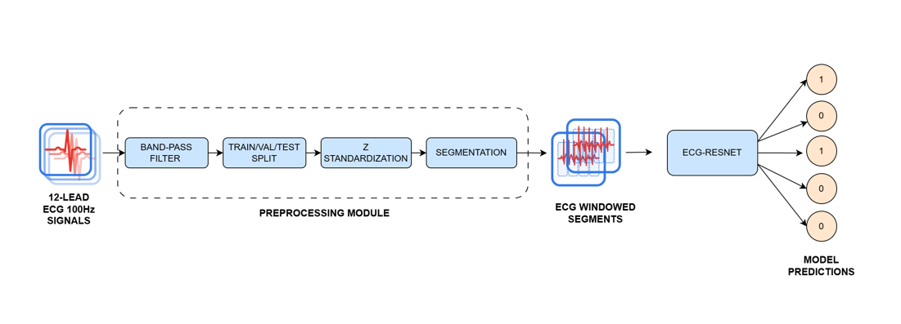
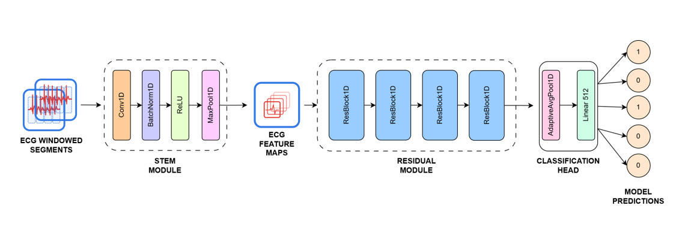

# ECG-Based Multi-Label Classification of Cardiac Conditions on PTB-XL

A lightweight 1D residual CNN (**ECGResNet**) for multi-label classification of five diagnostic ECG superclasses on the [PTB-XL](https://physionet.org/content/ptb-xl/1.0.1/) dataset, developed for the *Artificial Intelligence in Medicine* course at Politecnico di Torino.

## Overview

- Designed and trained **ECGResNet**, a lightweight 1D residual CNN, for multi-label classification of five diagnostic ECG superclasses (NORM, MI, STTC, CD, HYP) on the PTB-XL dataset.
- Conducted a sequential **four-phase ablation study** across architecture depth, loss functions, and activation functions to optimize model performance.
- Implemented **GradCAM1D** for model explainability, identifying key waveform regions driving correct and incorrect predictions.
- Evaluated performance using record-level aggregation with both threshold-free (AUC, AUPR) and threshold-dependent metrics, achieving a **macro AUC of 0.92**.

## Pipeline

12-lead ECG signals (100 Hz) are filtered, split, standardized, and segmented into overlapping windows before being passed to ECGResNet for multi-label prediction.



**Preprocessing module:** median filter → band-pass filter (0.5–40 Hz) → train/val/test split → z-standardization → segmentation.

## Model Architecture

ECGResNet follows a stem → residual blocks → classification head structure, inspired by the original ResNet design adapted to 1D ECG signals.



- **Stem module:** `Conv1D → BatchNorm1D → ReLU → MaxPool1D`
- **Residual module:** stacked `ResBlock1D` units with skip connections
- **Classification head:** `AdaptiveAvgPool1D → Linear(512)` → per-class logits

## Model Optimization

Model optimization followed a sequential three-phase ablation structure, with the best-performing configuration from each phase carried forward to the next.

1. **Residual architecture depth** — 4 residual blocks vs. 2 residual blocks
2. **Loss functions** — BCE vs. Weighted BCE vs. Focal Loss
3. **Activation functions** — ReLU vs. Mish vs. GELU

The final model uses **Focal Loss with ReLU activation**, selected based on validation AUC.

## Results

Evaluation was performed at the record level via max-pooling of segment-level predictions belonging to the same patient.

| Class | AUC | AUPR |
|-------|-----|------|
| NORM  | 0.9365 | 0.9029 |
| MI    | 0.9188 | 0.7652 |
| STTC  | 0.9301 | 0.8056 |
| CD    | 0.9106 | 0.8206 |
| HYP   | 0.9018 | 0.6095 |
| **Macro** | **0.9196** | **0.7807** |

HYP consistently emerged as the hardest class to classify, driven by class imbalance and sensitivity collapse at the standard 0.5 decision threshold.

## Explainability

GradCAM1D was used to visualize which regions of the ECG waveform drive the model's class predictions, helping identify the morphological features behind both correct classifications and misclassifications.

## Project Structure

```
.
├── assets/                  # Architecture and pipeline diagrams
├── src/
│   ├── models/               # ECGResNet, ResBlock1D
│   ├── datasets/              # PTB-XL loading and preprocessing
│   ├── training/               # Training loop, ablation configs
│   └── evaluation/
│       ├── metrics.py           # AUC, AUPR, F-score, Youden Index
│       └── gradcam.py            # GradCAM1D implementation
├── data/                     # Instructions for downloading PTB-XL (not included)
├── results/                  # Ablation tables and figures
├── requirements.txt
└── README.md
```

## Setup

```bash
pip install -r requirements.txt
```

The dataset is downloaded separately (see `data/README.md`) and is not included in this repository due to size.

## Team

- Ismail Aljosevic
- Diego Polito
- Alessandro Lkikm

*Artificial Intelligence in Medicine — Politecnico di Torino*
